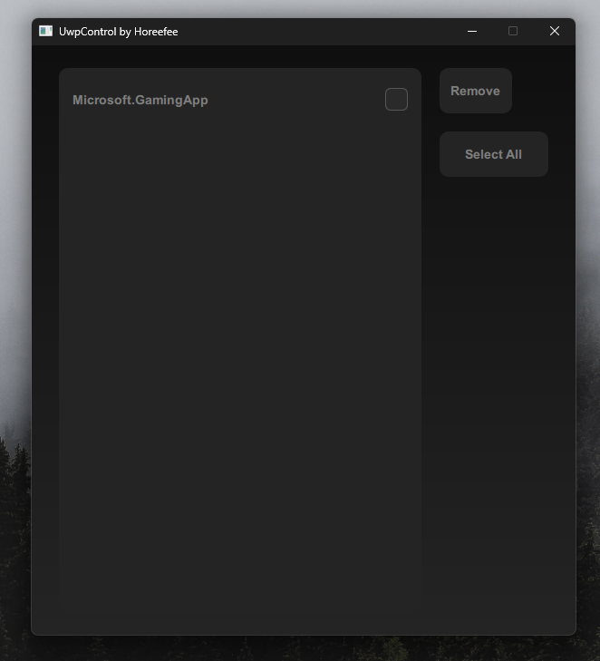

# UwpControl

# Hi, this is my program called UWPControl, written in QML. 
This program allows you to remove UWP applications. I want to point out that I'm a beginner, and UWPControl may not be the perfect solution.

To remove programs, UWPControl uses the PowerShell command: ``` Get-AppxPackage *ApplicationName* | Remove-AppxPackage ```

To select UWP applications, UWPControl uses "Whitelists," which means it works on the principle of blocking everything that isn't allowed, which minimizes the chance of damaging your system. 


# Whitelist programs: 
```
QStringList whiteList = {
        "Microsoft.BingNews", "Microsoft.BingWeather", "Microsoft.BingSports",
        "Microsoft.BingFinance", "Microsoft.GamingApp", "Microsoft.XboxSpeechToTextOverlay",
        "Microsoft.XboxIdentityProvider", "Microsoft.GetHelp", "Microsoft.Getstarted",
        "Microsoft.MicrosoftSolitaireCollection", "Microsoft.MixedReality.Portal", "Microsoft.Office.OneNote",
        "Microsoft.People", "Microsoft.SkypeApp", "Microsoft.MicrosoftStickyNotes",
        "Microsoft.YourPhone", "Microsoft.ZuneMusic", "Microsoft.ZuneVideo", "Microsoft.MicrosoftOfficeHub",
        "Microsoft.Microsoft365", "Microsoft.windowscommunicationsapps", "Microsoft.Todos",
        "Clipchamp.Clipchamp", "Microsoft.PowerAutomateDesktop", "Microsoft.WindowsFeedbackHub",
        "Microsoft.WindowsSoundRecorder", "Microsoft.549981C3F5F10", "Microsoft.DisneyPlus",
        "Microsoft.SpotifyMusic", "Microsoft.CandyCrushSaga", "Microsoft.CandyCrushSodaSaga",
        "Microsoft.KingCandyCrushBubbles", "Bytedance.TikTok", "4DF9EC11.Netflix",
        "King.com.BubbleWitch3Saga", "Microsoft.Bestaudio", "Microsoft.MSPaint",
        "Microsoft.ScreenSketch", "Microsoft.3DBuilder", "Microsoft.Print3D",
        "Microsoft.Microsoft3DViewer", "Microsoft.WindowsAlarms", "Microsoft.WindowsMaps",
        "Microsoft.OneConnect", "Microsoft.Wallet", "Microsoft.WindowsCamera"
    };
```



